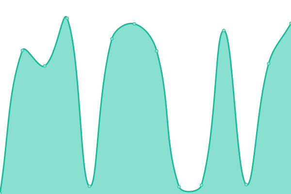
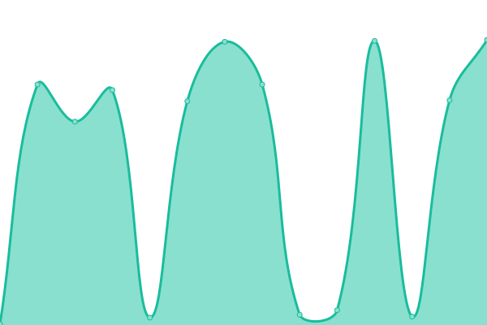

# [📈 Live Status](https://upptime.github.io/upptime): <!--live status--> **🟩 All systems operational**

This repository contains the open-source uptime monitor and status page for [Upptime](https://upptime.js.org), powered by [Upptime](https://github.com/upptime/upptime).

With [Upptime](https://upptime.js.org), you can get your own unlimited and free uptime monitor and status page, powered entirely by a GitHub repository. We use [Issues](https://github.com/upptime/upptime/issues) as incident reports, [Actions](https://github.com/mgmgpyaesonewin/strapi-upptime/actions) as uptime monitors, and [Pages](https://upptime.github.io/upptime) for the status page.

<!--start: status pages-->
<!-- This summary is generated by Upptime (https://github.com/upptime/upptime) -->
<!-- Do not edit this manually, your changes will be overwritten -->
<!-- prettier-ignore -->
| URL | Status | History | Response Time | Uptime |
| --- | ------ | ------- | ------------- | ------ |
|  [Strapi Home Page](https://cms.wavemoney.io) | 🟩 Up | [strapi-home-page.yml](https://github.com/mgmgpyaesonewin/strapi-upptime/commits/HEAD/history/strapi-home-page.yml) | 

 1164ms
     
 | 

<a href="https://mgmgpyaesonewin.github.io/strapi-upptime/history/strapi-home-page">99.54%</a>
    

|  [Merchant APP (Core Config API)](https://gateway.wavemoney.io/v2/merchant-api/merchant-core-config) | 🟩 Up | [merchant-app-core-config-api.yml](https://github.com/mgmgpyaesonewin/strapi-upptime/commits/HEAD/history/merchant-app-core-config-api.yml) | 

 3102ms
     
 | 

<a href="https://mgmgpyaesonewin.github.io/strapi-upptime/history/merchant-app-core-config-api">99.53%</a>
    

|  [Merchant APP (API Version API)](https://gateway.wavemoney.io/v2/merchant-api/url-version/entity/merchant) | 🟩 Up | [merchant-app-api-version-api.yml](https://github.com/mgmgpyaesonewin/strapi-upptime/commits/HEAD/history/merchant-app-api-version-api.yml) | 

 1449ms
     
 | 

<a href="https://mgmgpyaesonewin.github.io/strapi-upptime/history/merchant-app-api-version-api">99.53%</a>
    

|  [Merchant APP (HomePage API)](https://gateway.wavemoney.io/v2/merchant-api/merchant-home) | 🟩 Up | [merchant-app-home-page-api.yml](https://github.com/mgmgpyaesonewin/strapi-upptime/commits/HEAD/history/merchant-app-home-page-api.yml) | 

 1343ms
     
 | 

<a href="https://mgmgpyaesonewin.github.io/strapi-upptime/history/merchant-app-home-page-api">99.53%</a>
    

|  [Merchant APP (Terms & Conditions API)](https://gateway.wavemoney.io/v2/merchant-api/merchant-term-and-condition-content/get-latest) | 🟩 Up | [merchant-app-terms-and-conditions-api.yml](https://github.com/mgmgpyaesonewin/strapi-upptime/commits/HEAD/history/merchant-app-terms-and-conditions-api.yml) | 

 1893ms
     
 | 

<a href="https://mgmgpyaesonewin.github.io/strapi-upptime/history/merchant-app-terms-and-conditions-api">99.52%</a>
    

|  [Merchant APP (Stroy API)](https://gateway.wavemoney.io/v2/merchant-api/merchant-tutorial-stories/1) | 🟩 Up | [merchant-app-stroy-api.yml](https://github.com/mgmgpyaesonewin/strapi-upptime/commits/HEAD/history/merchant-app-stroy-api.yml) | 

 1049ms
     
 | 

<a href="https://mgmgpyaesonewin.github.io/strapi-upptime/history/merchant-app-stroy-api">99.52%</a>
    

|  [Channel APP (NRC API)](https://gateway.wavemoney.io/v2/wc-api/config-nrc/wc) | 🟩 Up | [channel-app-nrc-api.yml](https://github.com/mgmgpyaesonewin/strapi-upptime/commits/HEAD/history/channel-app-nrc-api.yml) | 

 399ms
     
 | 

<a href="https://mgmgpyaesonewin.github.io/strapi-upptime/history/channel-app-nrc-api">99.52%</a>
    

|  [Channel APP (Region API)](https://gateway.wavemoney.io/v2/wc-api/config-region/wc) | 🟩 Up | [channel-app-region-api.yml](https://github.com/mgmgpyaesonewin/strapi-upptime/commits/HEAD/history/channel-app-region-api.yml) | 

 389ms
     
 | 

<a href="https://mgmgpyaesonewin.github.io/strapi-upptime/history/channel-app-region-api">99.52%</a>
    

|  [Channel APP (Version API)](https://gateway.wavemoney.io/v2/wc-api/url-version/entity/wc) | 🟩 Up | [channel-app-version-api.yml](https://github.com/mgmgpyaesonewin/strapi-upptime/commits/HEAD/history/channel-app-version-api.yml) | 

 235ms
     
 | 

<a href="https://mgmgpyaesonewin.github.io/strapi-upptime/history/channel-app-version-api">99.52%</a>
    

|  [Wave Pay App (Mini App API)](https://gateway.wavemoney.io/v2/wp-api/wp-mini-app-categories) | 🟩 Up | [wave-pay-app-mini-app-api.yml](https://github.com/mgmgpyaesonewin/strapi-upptime/commits/HEAD/history/wave-pay-app-mini-app-api.yml) | 

 253ms
     
 | 

<a href="https://mgmgpyaesonewin.github.io/strapi-upptime/history/wave-pay-app-mini-app-api">99.52%</a>
    

<!--end: status pages-->

[**Visit our status website →**](https://upptime.github.io/upptime)

## 📄 License

- Powered by: [Upptime](https://github.com/upptime/upptime)
- Code: [MIT](./LICENSE) © [Upptime](https://upptime.js.org)
- Data in the `./history` directory: [Open Database License](https://opendatacommons.org/licenses/odbl/1-0/)
